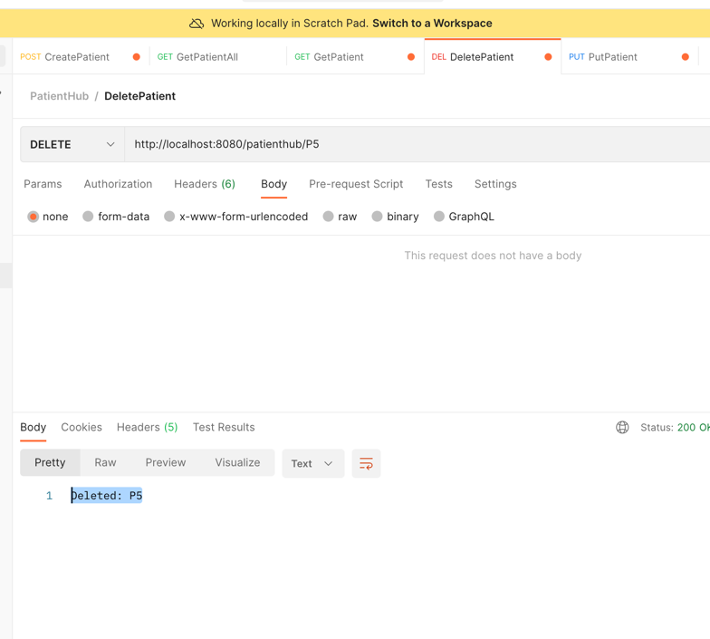

# Problem Statement - Straumann Group

Implement a simple patient hub service with provides a CRUD operation on patient and certain patient
resources (Feel free to define patient resource as per your imagination). Demonstrate the following in
this implementation:
- Implement caching using Spring Cache to retrieve patient data.
- Demonstrate Spring Boot's configuration management capabilities. Externalize application
  properties using property files or environment variables.
- Implement custom exception classes and handle common scenarios like validation errors or
  resource not found.
- Ensure profile-based configuration, enabling different configurations for different environments
  (dev, qa, prod)
- Add minimal unit test cases.
  You get Brownie points: If you can dockerize this application and present (just a slide) a pipeline for this
  service.

# PROJECT ARCHITECTURE

# CRUD

## CREATE PATIENT :
 
    ENDPOINT: 

        POST : http://localhost:8080/patienthub
- 
    REQUEST BODY:

          {
          "patientName": "Patient4",
          "patientId": "P4",
          "patientNumber": "Number4",
          "patientAddress": "Address4",
          "issueDescription": "Cold"
          }
- 
    RESPONSE BODY:

        Success: Patient4

    

## READ PATIENT :

    ENDPOINT: 
        GET : http://localhost:8080/patienthub/{id}
        GET : http://localhost:8080/patienthub
        
-

RESPONSE BODY:

      {
    "httpstatus": "OK",
    "data": {
        "patientName": "Patient4",
        "patientId": "P4",
        "patientNumber": "Number4",
        "patientAddress": "Address4",
        "issueDescription": "COLD"
    },
    "message": "Requested Patient details are given here"
    }

    

  
  

## UPDATE PATIENT :

    ENDPOINT: 

        PUT : http://localhost:8080/patienthub
-
REQUEST BODY:

        {
        "patientName": "Patient3 Updated",
        "patientId": "P4",
        "patientNumber": "Number4",
        "patientAddress": "Address4"
        }
-
RESPONSE BODY:

      Updated: Patient4 Updated

## DELETE PATIENT :

    ENDPOINT: 

        DELETE : http://localhost:8080/patienthub/{ID}

RESPONSE BODY:

      Deleted: P5

## Spring Cache Implemented 
- Dependency Used:

          <dependency>
          <groupId>org.springframework.boot</groupId>
          <artifactId>spring-boot-starter-cache</artifactId>
          </dependency>
- Annotations Used: 
  - @EnableCaching
  - @Cacheable
  - @CacheEvict
  - @CachePut

## Profile Based Configuration for DEV and PROD env.
-  To Specify env to run the application, use the env variable:

       PROFILE_ACTIVE=dev
       

## Implemented custom exception classes
- For any unknown patient, give exception

## Unit test Cases written using Junit, AssertJ, H2database

## Docker image for the springboot application

## Connected with Mysql database for storing patients details. Used MySql workbench to visualize the table.
- Dependency Used:

          <dependency>
  		<groupId>org.springframework.boot</groupId>
  		<artifactId>spring-boot-starter-data-jpa</artifactId>
  	</dependency>

  	<dependency>
  		<groupId>com.mysql</groupId>
  		<artifactId>mysql-connector-j</artifactId>
  		<scope>runtime</scope>
  	</dependency>

